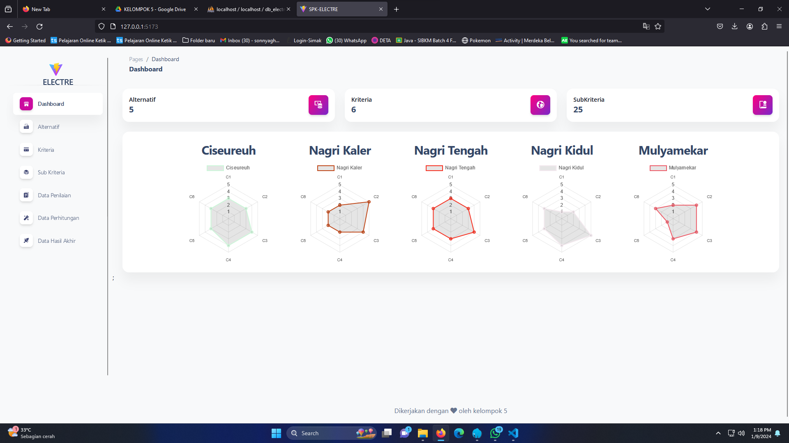
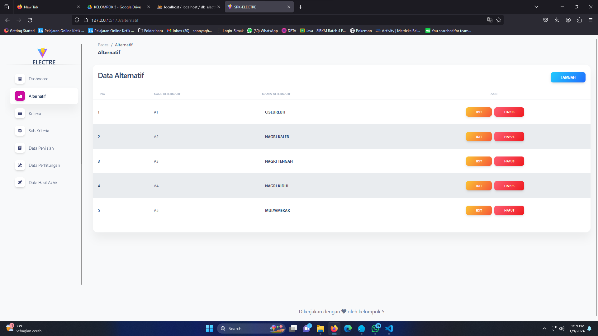
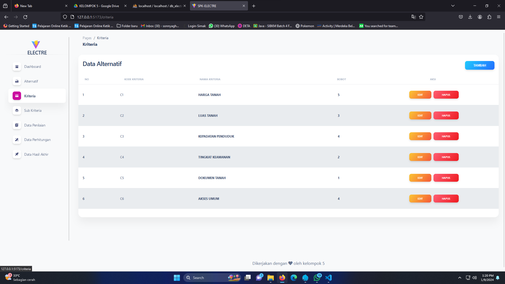
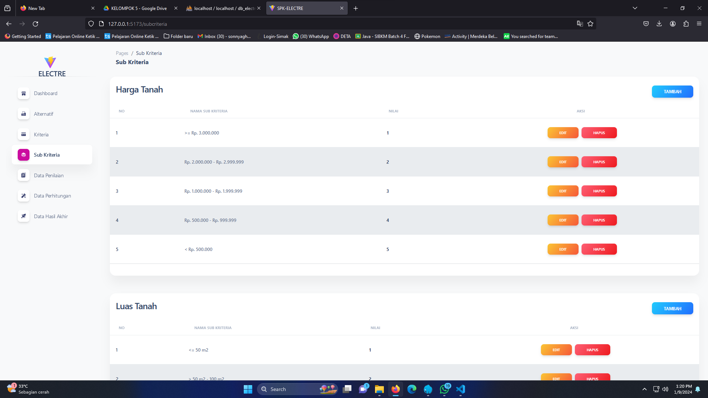
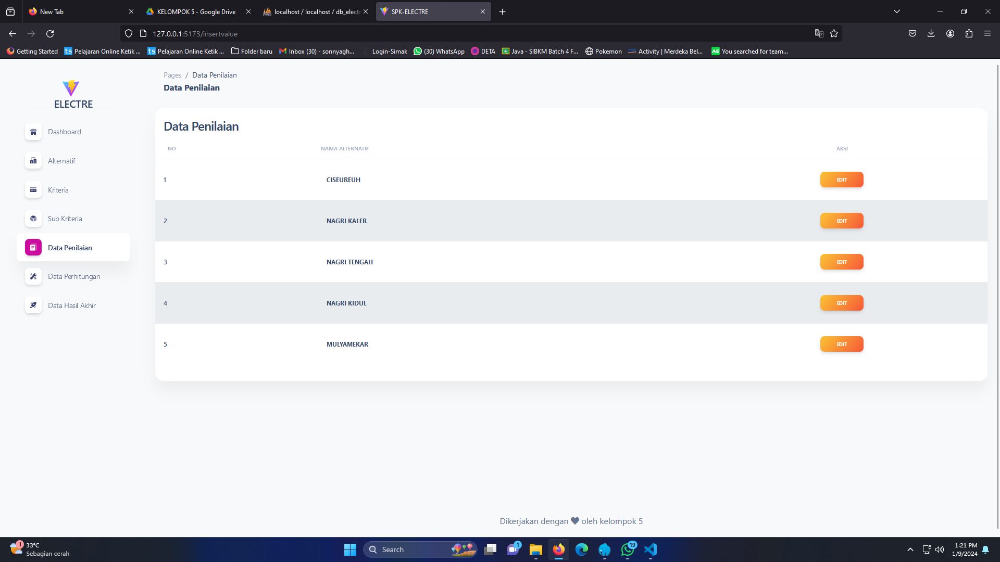
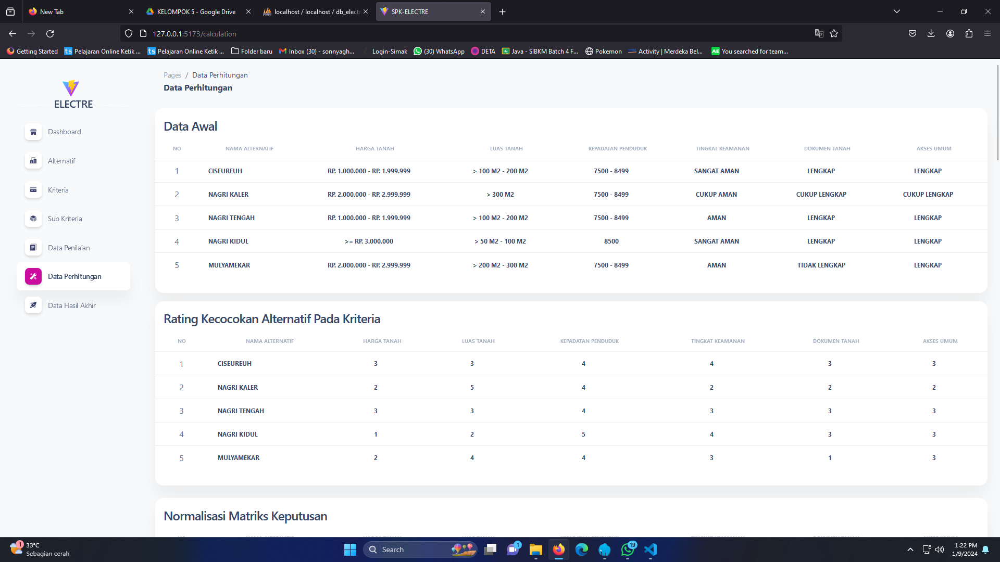
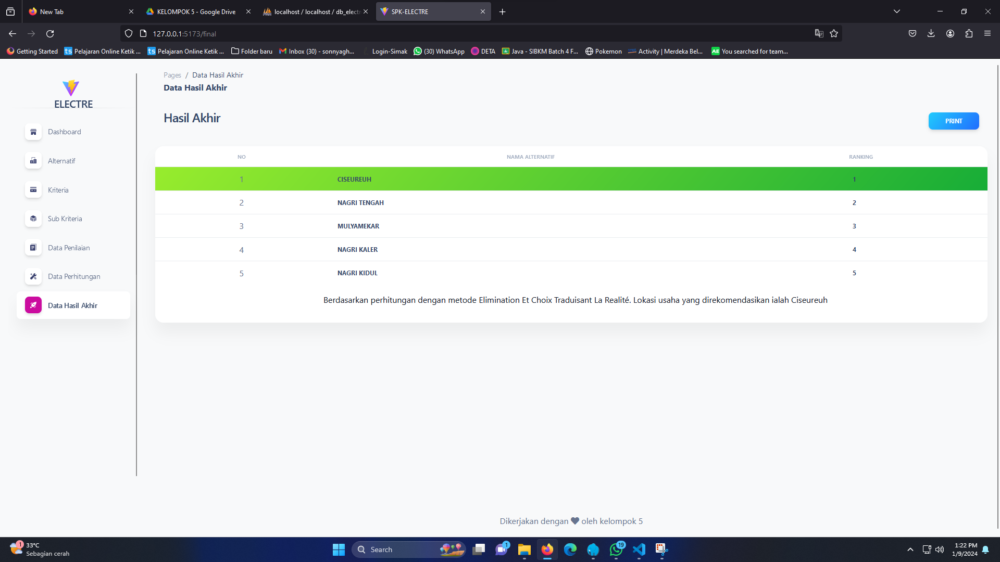

# ELIMINATION ET CHOIX TRADUISANT LA REALITE (ELECTRE)

#### SCREENSHOOT

1. Dashboard

   

2. Alternatif

   

3. Kriteria

   

4. Sub Kriteria

   

5. Data Penilaian

   

6. Data Perhitungan

   

7. Data Hasil Akhir

   

#### FRONT END

> **Requirements**

1. Node JS
2. PNPM

   ```
   npm install -g pnpm
   ```

> **How to run**

```
pnpm install
```

```
pnpm run dev
```

#### BACK END

> **Requirements**

1. Node JS
2. MySQL

> **How to run**

In MySQL reate a database with name db_electre

```
npm install
```

```
npm run api-service
```

#### MORE INFO

[WhatsApp](https://api.whatsapp.com/send/?phone=6285927532252)

[Instagram](https://www.instagram.com/ghandi.ar/)
